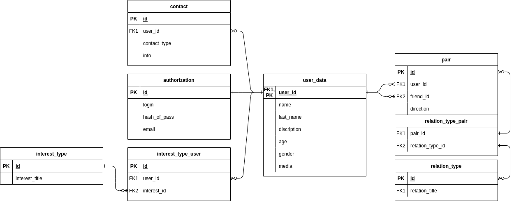

# PFP-PeopleForPeople
Цель проекта - создание веб-приложения сайта для знакомств.

| Этап                              | Описание                                                                                   | План (часов) | Факт (часов) |
|-----------------------------------|--------------------------------------------------------------------------------------------|--------------|--------------|
| База данных                       | Придумать схему базы данных согласно теме проекта. Минимум 7 таблиц, обязательное наличие связи многие ко многим. Желательно использовать PostgreSQL. | 8            | 15           |
| JDBC                              | Создание консольного приложения для выполнения CRUD-операций с использованием JDBC.     | 12          | Y            |
| JSP                               | Разработка клиентской части с использованием JSP.                                          | X            | Y            |
| Backend на SpringBoot + Hibernate | Создание бэкэнда приложения с использованием SpringBoot и Hibernate.                       | X            | Y            |
| Angular - Frontend                | Разработка фронтенда с использованием Angular.                                              | X            | Y            |
| React - Frontend                  | Разработка фронтенда с использованием React.                                                | X            | Y            |
## Выполнение первого задания: База данных 

Для начала проекта была разработана схема базы данных, соответствующая теме проекта - сайту для знакомств. В результате работы над этим этапом было выполнено следующее:

- Придумана схема базы данных, состоящая из 12 таблиц.
- Обеспечена обязательная наличие связи многие ко многим между таблицами(user_data & interest_type).
- Для реализации была выбрана PostgreSQL как основная СУБД.

Для ознакомления с деталями схемы базы данных, вы можете просмотреть [скрипт](./dataAboutDB/schema).
